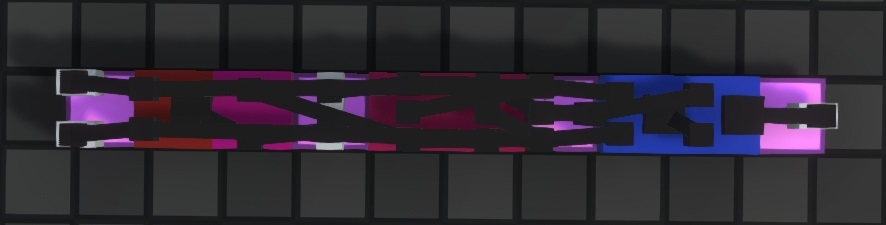

# MicroGates
based on LOOP's Chiplet Mod: https://github.com/Apoxtrophe/LOOPS-Chiplets-LogicWorld
using Cheese's component resizer: https://github.com/cheese3660/CheeseUtilMod
and bug-fixing help from Ecconia: https://github.com/Ecconia

!Mod made for LogicWorld v0.91 (Release).

This mod adds logic gates which fit on a single grid unit: smaller components which all fit together!

This mod also moves I/O of the components to the top, making it easier to build complex circuitry since all connections are vertically aligned and unobstructed. 

# 

Also includes a redesign of the vanilla ThroughPeg and the MiniSocket to be more ergonomic with the rest of the components.

# Circuit Examples
Full adder using some of the new components.

 1-tile wide instant-carry adder / subtractor.

16 bit multiplier.

# Dependancies

 Continue Here !!!

# Installation

Download the three folders in this directory, place them in GameData folder. (You must have dependancies installed here also to run properly)
